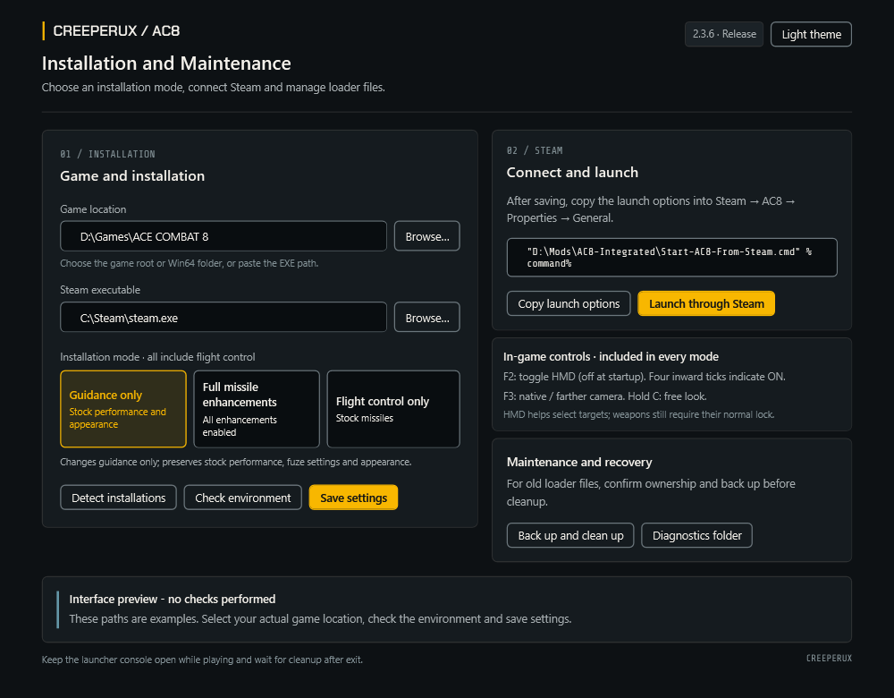

> [!WARNING]
> **Do not use this mod in online or multiplayer modes. Offline single-player only.**
> Confirm the game mode before installing, launching or testing. Online use is not supported.

[简体中文](README.md) | **English**

# AC8 Integrated Mod

Mouse-directed flight control, switchable camera positions and cursor-prioritized target selection (HMD) for **ACE COMBAT 8 on Steam**, with three selectable missile installation modes.

**Recommended release: v2.3.6** · Windows x64 · Game build **25201480**

Use v2.3.6 for both new installations and upgrades. Download the complete release package rather than an older version or the source-code ZIP.

- Latest release: [https://github.com/CreeperUX/AC8-Integrated-Mod/releases/latest](https://github.com/CreeperUX/AC8-Integrated-Mod/releases/latest)
- **English package:** [AC8-Integrated-v2.3.6-English.zip](https://github.com/CreeperUX/AC8-Integrated-Mod/releases/download/v2.3.6/AC8-Integrated-v2.3.6-English.zip)
- Chinese package: [AC8-Integrated-v2.3.6-share.zip](https://github.com/CreeperUX/AC8-Integrated-Mod/releases/download/v2.3.6/AC8-Integrated-v2.3.6-share.zip)
- [Installation and upgrades](docs/en/INSTALL.md) · [Flight and camera bindings](docs/en/KEYBINDINGS.md) · [Cleanup and recovery](docs/en/CLEANUP.md) · [Known limitations](docs/en/LIMITATIONS.md)

**Language availability:** v2.3.6 has separate Chinese and English packages with the same gameplay files. The English edition has no in-app language switch. Chinese/English switching is planned for 2.3.7.

## Installation interface

The installer can locate Steam and the game, accept manually selected paths, check the environment, save your installation mode, copy Steam launch options, start through Steam, and back up and clean up loader files. Multiple installations are offered as candidates; existing manual paths are not overwritten automatically.

## Main features

### Mouse-directed flight control

Move the mouse to set a desired direction in the world. The controller coordinates pitch, roll and yaw, with manual keyboard inputs taking priority. Select **Expert** controls in the game.

Press F4 to switch between CLASSIC and AGILE during flight. Both start from a standard response model and use feedback to learn aircraft- and speed-dependent responses. Switching policies keeps the current process's learning state. Learning is not saved between game sessions and is not a complete aerodynamic simulation. [Implementation details (Chinese)](docs/CONTROL.md)

### Camera positions and free look

F3 switches between the game's native relative camera position and a farther follow-camera position. Both retain mouse-follow orientation and aircraft-centered observation. Hold C for free look; releasing it preserves the original flight target direction.

The default farther position is 36 m behind and 6 m above the aircraft. Edit `MouseAim-Settings.ini` while the game is closed to change the startup mode, distance or height. The controller includes a one-time recenter after mission initialization, scripted-camera handback and pause recovery. [Camera guide](docs/en/CAMERA.md)

### HMD target selection

F2 toggles cursor-prioritized target selection. **It starts disabled each time the game is launched.** With HMD enabled, use the game's normal target-switch key to prefer a valid candidate close to the mouse aiming circle. Unsuitable or stale candidates fall back to native selection.

Four inward ticks on the aiming circle show that HMD is enabled, alongside the existing ON / OFF / UNAVAILABLE notification. Selecting a target does not complete a weapon lock: range, lock angle and lock time remain subject to the game. [HMD guide](docs/en/HMD.md)

## Three installation modes

**Every mode includes flight control, camera functions and HMD.** Choose one mode; they are alternatives, not installation steps.

| Mode | Missile behavior | Configuration |
|---|---|---|
| **Flight control + guidance only** | Changes only player-missile proportional guidance. Preserves stock speed, maneuverability, lifetime/range, lock parameters, damage, reloads, ready-round counts, proximity-fuze settings and appearance. | `missile_mode=guidance` |
| **Flight control + full missile enhancements** | Enables proportional guidance and substantially adjusts missile performance with the goal of approaching its behavior in *War Thunder*, including proximity-fuze and visual changes. | `missile_mode=full` |
| **Flight control only** | Does not install the missile module; missiles retain their stock behavior. | `missile_mode=none` |

Changing guidance still changes interception trajectories even when performance parameters remain stock. The full mode operates within AC8's mechanics; it is not a complete reproduction of War Thunder's missile simulation, and results vary by aircraft and weapon.

A fresh package defaults to **full missile enhancements**. Confirm your selection before saving. Legacy `missile_enhancement=1/0` settings map to `full/none`. Close the game and finish cleanup before changing modes; changes apply on the next launch. F2, F3, F4 and F8 do not change the installation mode.

## Quick start

1. Download the complete release ZIP and extract it **outside the game directory**, for example `D:\Mods\AC8-Integrated`. Do not run it inside the ZIP or manually copy `payload` into the game.
2. Close the game normally and wait for any old launcher to finish cleanup.
3. Run **`Start-GUI.cmd`**. Wait for automatic detection and checks, or browse to the game root, `Win64` folder or `AceCombat8.exe`.
4. Check the Steam path, choose a mode, and click **Save settings**.
5. Click **Copy launch options** and paste the entire line into Steam → AC8 → Properties → General → Launch Options. This step remains manual.
6. Click **Launch through Steam**, or launch from Steam. Use Expert controls and a third-person view.
7. Keep the launcher console open while playing. After exiting, wait for archiving, cleanup and Steam Cloud synchronization to finish.

Python and NumPy are not needed for normal play. They are used only for optional analysis, which is skipped when unavailable. The alternative console menu in `Setup.cmd` and `Choose-Features.cmd` uses 1 = guidance only, 2 = full enhancements, 3 = flight control only.

## Author's flight and camera bindings

Verified from the author's saved AC8 configuration on **2026-10-05**. These are **personal settings, not game defaults**. Secondary bindings are alternatives, not key combinations. This table excludes unrelated weapon, menu and chat controls.

| Game action | Primary | Secondary |
|---|---|---|
| Pitch down / up | W / S | Unbound |
| Roll left / right | A / D | Unbound |
| Yaw left / right | Q / E | Unbound |
| Accelerate / increase throttle | Left Shift | Unbound |
| Decelerate / brake | Left Ctrl | Unbound |
| Native autopilot | Z | Unbound |
| Landing gear | G | Unbound |
| Native camera control | C | Left Alt |
| Look up / down | Number row 7 / 8 | Numpad 8 / 2 |
| Look left / right | Number row 9 / 0 | Numpad 4 / 6 |
| Native view switch | V | Unbound |
| Switch target (used with HMD) | F | Right mouse button |

### Mod shortcuts

| Input | Function |
|---|---|
| Mouse movement | Set the flight target direction |
| Hold C + move mouse | Mod free look |
| **F2** | Toggle HMD; disabled at startup |
| **F3** | Native relative / farther follow-camera position |
| **F4** | CLASSIC / AGILE control policy |
| F5 / F6 | Performance / camera diagnostics |
| F7 | Show or hide the mod HUD and its notifications |
| F8 | Toggle mouse flight control; does not uninstall missile changes |
| F9 | Recenter the target direction |
| F10 | Reload the current runtime copy of the settings and recenter |

Important distinctions:

- **V versus F3:** V changes the game's native view; F3 changes the mod's camera-position profile.
- **C versus Left Alt:** both are saved game bindings, but the mod's free-look path checks C directly. Left Alt is not an equivalent mod shortcut.
- **F2/F3/F4:** release Shift, Ctrl and Alt before pressing them. Holding the throttle or brake key can prevent these toggles.
- Manual override detection uses W/S, A/D and Q/E; W/S also yield automatic roll. Changing only the game's bindings does not change this detection.

The installer does not modify your game bindings. See the [complete reference](docs/en/KEYBINDINGS.md) for individual entries. No raw settings save, account data or campaign progress is distributed.

## Upgrades, cleanup and removal

Extract upgrades into a new directory, save the new settings, and update Steam launch options. Do not overwrite a package with an unfinished session or run several packages concurrently.

**Back up and clean up** asks you to confirm ownership, verifies a backup, and then removes recognized package-owned `dwmapi.dll`, `ue4ss` and `steam_appid.txt` items. A running game, unknown loader, other mods or unsafe filesystem links can block cleanup. `Recover-Cleanup.cmd` can also handle historical leftovers. [Recovery guide](docs/en/CLEANUP.md)

To stop using the mod, exit normally, finish cleanup, and remove its Steam launch option. F8 only disables mouse flight control; it does not disable the entire mod.

## Troubleshooting

| Problem | What to do |
|---|---|
| Game not found | Use automatic detection or Browse. In older Setup scripts, the path prompt is not asking for a menu number. |
| Package inside the game folder | Move the complete package outside it, then save settings and update launch options. |
| Existing loader / leftovers | Confirm ownership and use backup cleanup; do not delete an unknown DLL. |
| DLL write denied | Check that file's permissions, read-only attribute and security-software protection history. A general write probe cannot guarantee a DLL will not be blocked separately. |
| NumPy missing | Normal play is unaffected; optional analysis is skipped. |
| HMD UNAVAILABLE | HMD could not be enabled. Keep the diagnostic output and check the supported game build. It does not indicate a weapon lock. |
| Version check fails after an update | Only build 25201480 is supported. Do not replace the EXE or bypass validation. |

## Validation and limitations

v2.3.6 includes lifecycle fixes intended to reduce stale-object lookup risks during mission exit while retaining checkpoint appearance recovery. [Implementation record (Chinese)](docs/LIFECYCLE-FIX.md)

Flight, camera, HMD, installation, cleanup and package checks have automated coverage. This is not proof of complete coverage across every computer, mission, aircraft, graphics driver and mod combination. Continue to report mission-exit, hangar-return, checkpoint and HUD-ghosting problems. Simulated tests cannot guarantee the absence of all native UE4SS crashes or identical improvements on every aircraft. [Known limitations](docs/en/LIMITATIONS.md)

Include the package version, game build, aircraft, installation mode, F2/F3/F4 states and reproduction steps in reports. Prefer error text or screenshots. **Do not upload the whole `sessions` folder:** it may contain personal save backups. Redact personal paths from logs.

## Credits and development

Based on [FletcherMiya/AC8-Mouse-Aim](https://github.com/FletcherMiya/AC8-Mouse-Aim). Thanks to FletcherMiya and the upstream contributors. This is an independently maintained community derivative; upstream authors do not endorse these modifications.

Third-party code, font and design-resource credits and licenses are preserved. [Notices](THIRD_PARTY_NOTICES.md) · [Development (Chinese)](docs/DEVELOPMENT.md) · [Changelog](CHANGELOG.md) · [English-interface preparation](docs/LOCALIZATION.md)
