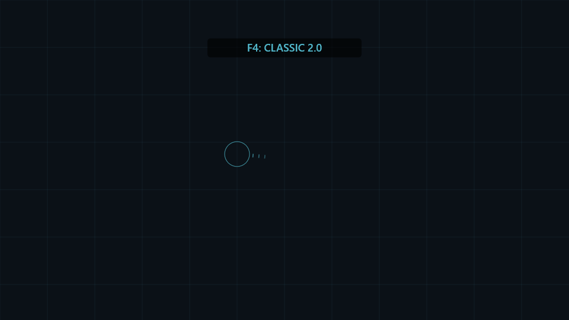

> 当前本地候选为 **2.3.5-camera-preview.3**：两种视角、F3临时切换及任务/过场自动回中，详见 [视角说明](docs/CAMERA-CONTEXT.md)。未公开发布，飞控算法沿用2.3.2。

# AC8 Integrated Mod

> **三模式图形界面本地预览：** 本包接入 v2.3.4 的三种安装范围，双击 `Start-GUI.cmd` 使用 CreeperUX 界面。尚未发布；公开 v2.3.2 仍只有两种范围。[图形界面说明](docs/GUI-PREVIEW.md)。

> **旧版清理后仍报加载器冲突？** 已发布独立 [历史残留清理工具 v1.0.0](https://github.com/CreeperUX/AC8-Integrated-Mod/releases/tag/cleanup-v1.0.0)，用于旧包会话记录丢失、只剩 DLL 或清理中断等问题。先备份校验再处理可确认归属的残留；[使用步骤与限制](docs/CLEANUP.md)。旧版整合包不会自动更新，工具不改变飞控版本。

为 **ACE COMBAT 8 Steam 版**提供鼠标飞控、在线响应模型学习和可选的导弹强化模块。

> **安装范围自由选择：**飞控＋仅比例引导、飞控＋完整导弹强化、仅飞控。运行 `Setup.cmd` 或退出游戏后运行 `Choose-Features.cmd`。[安装与切换说明](docs/INSTALL.md)。

## 项目基础与致谢

**本项目基于 [FletcherMiya/AC8-Mouse-Aim](https://github.com/FletcherMiya/AC8-Mouse-Aim) 发展而来。**原项目为 AC8 鼠标飞控的实现提供了重要基础；在此基础上，本项目进一步加入在线模型学习、双档控制切换、GUI 改进及可选导弹模块等功能。

**特别感谢原作者 FletcherMiya 及原项目贡献者的开发与分享。**本仓库保留上游署名和许可说明；这是独立维护的社区衍生项目，不代表原作者对本项目改动的背书。其他参考项目与导弹模块的来源见 [第三方署名与许可](THIRD_PARTY_NOTICES.md)。

鼠标指定世界方向，飞机自动追随；按住 C 自由观察，F4 在稳健与积极两档飞控间切换。**不需要导弹改动时，可以只安装鼠标飞控。**

当前候选包：**v2.3.4**。飞控沿用 v2.3.2 基线，M15 与 Setup 编码修复保留。适配 Build **25201480**、Windows x64，仅限离线单人游戏，禁止用于多人游戏。

[安装包发布页](https://github.com/CreeperUX/AC8-Integrated-Mod/releases) · [完整安装说明](docs/INSTALL.md) · [控制原理](docs/CONTROL.md) · [开发与构建](docs/DEVELOPMENT.md) · [已知限制](docs/LIMITATIONS.md)

## 选择安装范围

| 安装范围 | 菜单选项 | 配置值 |
|---|---:|---|
| 飞控 + 仅比例引导 | 1 | `missile_mode=guidance` |
| 飞控 + 完整导弹强化 | 2 | `missile_mode=full` |
| 仅飞控，原版导弹 | 3 | `missile_mode=none` |

这三种范围是并列选择，不需要按顺序安装。`Setup.cmd` 首次安装和 `Choose-Features.cmd` 后续更改使用同一菜单。回车保留当前选择，新包初始为完整强化；旧配置会兼容迁移，原完整强化保持完整，原仅飞控保持仅飞控。旧版菜单编号不同，请以选项名称为准。

**仅比例引导**只调整玩家导弹的引导参数，保留原版速度、转向能力、寿命/射程、锁定、伤害、装填、待发数量、近炸设置及外观；不会把原本没有近炸的导弹改成近炸。引导方式变化本身仍会改变拦截轨迹。

**完整强化**保留现有比例引导、性能强化、近炸参数和外观替换，包括检查点重生后的外观维护。**仅飞控**不安装导弹模块。

更改前必须正常退出游戏并等待清理完成，下次启动生效。F4 仍只切换飞控策略，F8 仍只开关鼠标飞控。

## 快速开始

1. 完整解压 v2.3.4 候选安装包到游戏目录之外；Source code ZIP 不是运行包。
2. 退出游戏并等待旧控制台清理完成。
3. 运行 `Setup.cmd`，输入游戏目录并按名称选择任意一种安装范围。
4. 将生成的 `Steam-Launch-Option.txt` 整行复制到 Steam 启动选项。
5. 从 Steam 或 `Start.cmd` 启动，游戏操纵类型选 Expert／专家。
6. 游戏退出后保留控制台，等待归档、清理和 Steam 云同步完成。

## 操作

| 按键 | 功能 |
|---|---|
| 鼠标 | 指定希望机头追随的世界方向 |
| **F3** | 游戏原生视角 ↔ 拉远跟随视角（本次运行） |
| **F4** | `CLASSIC 2.0` ↔ `AGILE 2.1`；默认积极档 |
| **F8** | 开关整个鼠标飞控，不卸载导弹模块 |
| F9 | 将目标方向回中 |
| 按住 C | 自由观察，保持原飞行目标方向 |
| W/S、A/D、Q/E | 手动操纵优先；W/S 同时让出自动滚转 |
| F7 | 开关 Mod 圆环 GUI |
| F10 | 重读本次运行副本配置并回中 |

GPU GUI 会短暂显示切换档位；过渡约 0.35 秒，已经学到的模型不会因 F4 切换清空。游戏原有键位如与 F4/C 冲突，需要自行改绑。

## 飞控特点

- 俯仰、滚转、偏航从标准模型起步，持续使用实际操纵和姿态反馈。
- 每架飞机独立学习增益、响应时间和延迟；候选通过后续验证后，平滑用于控制。
- **CLASSIC** 保留 v2.0 的限幅和阻尼；**AGILE** 在有足够制动余量时提高操纵权限，靠近目标时收紧。
- 原始机动性能仍由游戏决定。模型是独立轴响应近似，**不等同于完整气动模型或 War Thunder 的完整飞控**。
- 学习状态只在当前游戏进程内保存，退出后重置。不同速度区间的验证覆盖还有限制。

## 可选导弹模块

- 普通 MSL 使用增强机动/制导/伤害配置，保留空地目标能力与常规装填。
- 4AAM/6AAM 锁定距离配置约 10 km，LAAM 约 20 km；实际效果仍受游戏机制影响。
- 玩家空空导弹写入近炸相关字段；所有弹种实际触发尚未全面验收。
- `msl_a0/a1` 按规则使用 QAAM 外观；F-14、F-4、A-6、EA-6B 排除。台风与 JAS39E 使用 SASM 外观；`f0/r0/j0` 保留原模型。
- 挂载模型被检查点重置时，有限范围的引用检查触发恢复，不反复写入整套性能字段。

LAAM 的 4 发待发是配置目标，全部机型的实际槽位尚未确认。启用碰撞的已发射导弹实体仍可能保留原外观。详见[已知限制](docs/LIMITATIONS.md)。

## 验证状态与参与开发

已有多机型实飞记录确认三轴控制和部分学习参数实际生效；F4 切换及可选安装流程通过本地回归检查，完整游戏交互仍作为预发布验收内容。模拟测试结果不代表每架飞机都会改善。

源码仓库不含游戏资源、个人存档、原始试飞日志或预编译 DLL。可运行包中的 UE4SS 运行库固定版本并附许可证；构建流程见 [DEVELOPMENT.md](docs/DEVELOPMENT.md)。

欢迎提交问题和改进。反馈时请写明游戏 Build、机型、安装选项、飞控档位及复现步骤；不要上传完整 `sessions` 文件夹，其中可能含个人存档。

本项目继承并修改了 [FletcherMiya/AC8-Mouse-Aim](https://github.com/FletcherMiya/AC8-Mouse-Aim)，并使用 MouseFlight、MinHook、RE-UE4SS 的相关代码。署名和许可见 [THIRD_PARTY_NOTICES.md](THIRD_PARTY_NOTICES.md)。

## English overview

This project is developed from [FletcherMiya/AC8-Mouse-Aim](https://github.com/FletcherMiya/AC8-Mouse-Aim). Special thanks to FletcherMiya and the upstream contributors for their work and for sharing the original project. This is an independently maintained community derivative; upstream attribution and license notices are preserved.

Mouse-directed flight control with per-aircraft online response identification, runtime Classic/Agile switching, free look and an **optional** missile enhancement module. Windows x64 / Steam build 25201480 / offline single-player only. Download a release package, run `Setup.cmd`, choose features, and paste the generated Steam launch option. F4 selects the control policy; F8 toggles mouse assistance. See the linked documentation for limitations and source builds.
