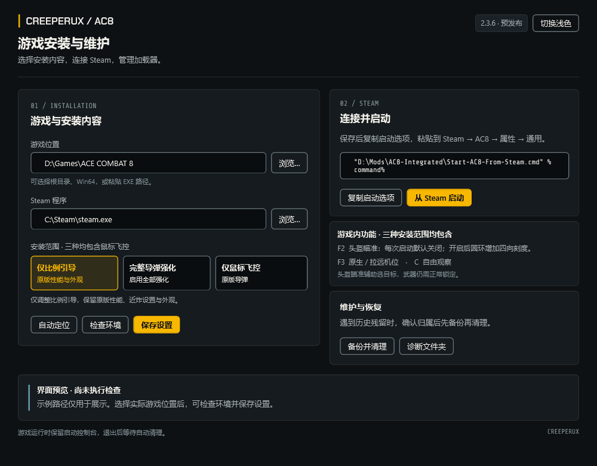

> [!WARNING]
> **严禁将本 Mod 用于线上或多人模式。仅限离线单人模式使用。**
> 安装、启动及测试前请确认所处模式。本项目不提供线上使用支持。

# AC8 Integrated Mod

为 **ACE COMBAT 8 Steam 版**提供鼠标飞控、摄像机切换与头盔瞄准具（HMD）辅助选目标，并提供三种可选的导弹安装范围。

**当前公开版本：v2.3.6（预发布）** · Windows x64 · 游戏 Build **25201480**

- 完整安装包：[AC8-Integrated-v2.3.6-share.zip](https://github.com/CreeperUX/AC8-Integrated-Mod/releases/download/v2.3.6/AC8-Integrated-v2.3.6-share.zip)
- 发布页：[https://github.com/CreeperUX/AC8-Integrated-Mod/releases/tag/v2.3.6](https://github.com/CreeperUX/AC8-Integrated-Mod/releases/tag/v2.3.6)
- [安装与升级](docs/INSTALL.md) · [作者当前飞行／视角键位](docs/KEYBINDINGS.md) · [清理与恢复](docs/CLEANUP.md) · [已知限制](docs/LIMITATIONS.md)

请下载 Release 的完整安装包。GitHub 的 **Code → Download ZIP / Source code** 是源码，不能直接当作运行包使用。

## 安装界面

当前版本的真实 WPF 界面渲染，使用示例路径展示；不是游戏画面。采用 CreeperUX UI Kit 2.4.0 的原生样式适配，支持深浅主题。主界面没有滚动条，窗口较小时整体缩放。

界面提供 Steam／游戏自动定位、手动路径选择、环境检查、安装范围选择、启动选项复制、Steam 启动，以及专用的备份清理入口。多个安装位置会提供候选列表；已有手动路径不会被擅自覆盖。

## 三项主要功能

### 鼠标飞控

移动鼠标指定希望机头追随的世界方向，由飞控协调俯仰、滚转和偏航。键盘操纵保留手动优先；游戏操纵类型应选择 **Expert／专家**。

提供 CLASSIC 与 AGILE 两种策略，使用 F4 在飞行中切换。系统从标准响应模型起步，按机型和速度区间利用实际反馈学习；切换策略不会清空当前进程的学习结果。学习不是永久存档，也不代表重建了完整气动模型。[控制实现](docs/CONTROL.md)

### 摄像机与自由观察

F3 在游戏原生相对机位与拉远跟随机位之间切换。两档均保留鼠标跟随和绕飞机观察，按住 C 可自由观察，松开后保留原飞行目标。

默认拉远机位为机后 36 米、上方 6 米；启动机位及距离、高度可在关闭游戏后修改 `MouseAim-Settings.ini`。任务初始化、剧情归还控制和暂停恢复时包含一次性回中处理。[视角说明](docs/CAMERA-CONTEXT.md)

### 头盔瞄准具（HMD）

F2 开关鼠标优先选目标，**每次启动默认关闭**。开启后，使用游戏原本的目标切换键，优先选取鼠标瞄准圈附近的有效候选；没有适合候选或数据失效时回退原生选择。

开启状态以圆环内的四枚短刻度持续表示，同时保留 F2 ON／OFF／UNAVAILABLE 通知。目标选择不等于武器锁定，射程、锁定角和锁定时间仍由游戏决定。[HMD 说明](docs/HELMET-SELECTION.md)

## 三种安装范围

**三种范围均包含鼠标飞控、摄像机功能与 HMD。** 它们是并列选项，不需要依次安装。

| 安装范围 | 导弹行为 | 配置值 |
|---|---|---|
| **飞控＋仅比例引导** | 仅调整玩家导弹的比例引导；保留原版速度、机动性、寿命／射程、锁定、伤害、装填、待发数量、近炸设置及外观 | `missile_mode=guidance` |
| **飞控＋完整导弹强化** | 启用比例引导并大幅调整导弹性能，以接近其在《战争雷霆》中的表现为目标；同时包含近炸参数和模型外观调整 | `missile_mode=full` |
| **仅鼠标飞控** | 不安装导弹模块，保留原版导弹行为 | `missile_mode=none` |

仅比例引导虽然保留性能参数，仍会因为引导方式不同而改变拦截轨迹。完整强化基于 AC8 自身机制，并非《战争雷霆》导弹仿真的完全复刻；不同弹种和机型的效果以实际表现为准。

新包默认选择**完整导弹强化**，保存前请确认所需范围。旧 `missile_enhancement=1/0` 分别兼容读取为 `full/none`。更改范围需先正常退出游戏并完成清理，下次启动生效；F2/F3/F4/F8 都不是安装范围开关。

## 快速安装

1. 下载完整安装包，**完整解压到游戏目录之外**，例如 `D:\Mods\AC8-Integrated`。不要在 ZIP 内直接运行，也不要手动复制 `payload` 到游戏目录。
2. 正常退出游戏，等待旧版启动控制台完成清理。
3. 双击 **`Start-GUI.cmd`**。等待自动定位与环境检查；也可浏览文件夹、输入游戏根目录、Win64 目录或 `AceCombat8.exe` 路径。
4. 核对 Steam 路径，选择安装范围，点击**保存设置**。
5. 点击**复制启动选项**，粘贴到 Steam → AC8 → 属性 → 通用 → 启动选项。这一步仍由玩家完成。
6. 点击**从 Steam 启动**，或在 Steam 中开始游戏。操纵类型选择 Expert／专家，视角使用第三人称。
7. 游戏运行期间保留启动控制台；正常退出后等待归档、清理和 Steam 云同步完成。

普通游玩不需要 Python 或 NumPy。它们只用于可选的数据分析；缺少时会跳过分析。`Setup.cmd` 与 `Choose-Features.cmd` 保留为命令行入口，其菜单顺序为 1 仅比例引导、2 完整强化、3 仅飞控。

## 作者当前使用的飞行与视角键位

以下于 **2026-10-05** 从作者当前保存配置核对，**不是游戏默认键位**。只整理飞行、视角与 HMD 相关目标切换；不列全部武器、菜单和聊天操作。备用键不是组合键。

| 游戏操作 | 主按键 | 备用按键 |
|---|---|---|
| 压低／抬起机头 | W / S | 未绑定 |
| 向左／向右滚转 | A / D | 未绑定 |
| 向左／向右偏航 | Q / E | 未绑定 |
| 加速／增加油门 | 左 Shift | 未绑定 |
| 减速／刹车 | 左 Ctrl | 未绑定 |
| 原生自动驾驶 | Z | 未绑定 |
| 起落架收放 | R | 未绑定 |
| 原生视角控制 | C | 左 Alt |
| 视角向上／向下 | 主键区 7 / 8 | 数字小键盘 8 / 2 |
| 视角向左／向右 | 主键区 9 / 0 | 数字小键盘 4 / 6 |
| 原生视角切换 | V | 未绑定 |
| 切换目标（HMD 关联） | T | 鼠标右键 |

### Mod 快捷键

| 按键 | 功能 |
|---|---|
| 鼠标移动 | 指定飞行目标方向 |
| 按住 C + 移动鼠标 | Mod 自由观察 |
| **F2** | HMD 开关，每次启动默认关闭 |
| **F3** | 原生相对机位／拉远跟随机位 |
| **F4** | CLASSIC／AGILE 飞控策略 |
| F5 / F6 | 性能诊断／视角诊断，供排错使用 |
| F7 | Mod HUD 及提示显示开关 |
| F8 | 鼠标飞控开关，不卸载导弹模块 |
| F9 | 瞄准方向回中 |
| F10 | 重读本次运行副本配置并回中 |

**请区分以下操作：**

- **V 与 F3**：V 是游戏原生视角切换；F3 是 Mod 的两种机位方案。
- **C 与左 Alt**：当前游戏保存了两者，但 Mod 自由观察直接检测 C，左 Alt 不是 Mod 的等价备用键。
- **F2/F3/F4**：松开 Shift、Ctrl、Alt 后单按；持续按住油门或刹车键时可能不会切换。
- Mod 以 W/S、A/D、Q/E 判断手动接管，W/S 也会让出自动滚转。单独改游戏键位不会自动同步这项检测。

安装器不会覆盖玩家键位。完整逐项表及可读 JSON 见 [KEYBINDINGS.md](docs/KEYBINDINGS.md)。仓库与安装包均不包含作者的原始设置存档、账号数据或进度。

## 升级、清理与停用

升级请使用新解压目录，重新保存设置并更新 Steam 启动选项；不要覆盖仍有未完成会话的旧目录，也不要同时运行多个整合包。

界面的**备份并清理**会要求确认归属，先备份和校验，再处理可确认属于本包的 `dwmapi.dll`、`ue4ss` 和 `steam_appid.txt`。游戏运行中、未知加载器、其他 Mod 或不安全的目录链接会阻止清理。历史残留也可使用 `Recover-Cleanup.cmd`。[清理说明](docs/CLEANUP.md)

彻底停用时，正常退出并清理，然后移除 Steam 中指向本包的启动选项。F8 只关闭鼠标飞控，不能代替停用整个 Mod。

## 常见问题

| 情况 | 处理方法 |
|---|---|
| 找不到游戏 | 使用 GUI 自动定位或浏览；旧版 Setup 的路径提示处不能输入安装菜单数字 |
| 整合包位于游戏内部 | 将整个整合包移到游戏目录之外，重新保存设置和更新启动选项 |
| 已有加载器／清理残留 | 核对归属后使用备份清理；不要直接删除未知 DLL |
| DLL 写入被拒绝 | 检查具体文件权限、只读属性及安全软件保护历史；通用目录写入检查不保证 DLL 不被单独拦截 |
| 缺少 NumPy | 不影响普通游玩，只跳过可选分析 |
| HMD UNAVAILABLE | HMD 未能启用；保留诊断并核对固定游戏 Build，不代表武器已锁定 |
| 游戏更新后校验失败 | 当前仅适配 Build 25201480，不要替换 EXE 或绕过版本检查 |

## 验证范围与已知限制

v2.3.6 包含任务退出生命周期修复：减少外观巡检、延迟回调及 HMD 采样中的旧对象查找，并保留检查点外观恢复。[修复说明](docs/LIFECYCLE-FIX.md)

已执行原生飞控／相机／HMD、Lua 生命周期与三模式、PowerShell 安装与清理、WPF 界面和完整包校验。用户已确认可以公开发布；这些结果不代表所有电脑、任务、机型、显示驱动和模组组合都已覆盖。因此本版保留**预发布**标记，并记录已知限制。

特别是退出任务、回机库、检查点重生以及曾出现 HUD 残影的设备仍需持续收集反馈。模拟测试不能保证所有 UE4SS 原生崩溃均已消除，也不保证每架飞机都获得相同改善。[完整限制](docs/LIMITATIONS.md)

反馈请注明版本、游戏 Build、机型、安装范围、F2/F3/F4 状态和复现步骤。优先提供报错文字或截图；**不要上传整个 `sessions` 文件夹**，其中可能含个人存档备份。日志或诊断中的个人路径请先遮去。

## 项目基础与致谢

本项目基于 [FletcherMiya/AC8-Mouse-Aim](https://github.com/FletcherMiya/AC8-Mouse-Aim) 发展，感谢原作者 FletcherMiya 及其贡献者的工作与分享。本项目是独立维护的社区衍生版本，不代表上游对改动的背书。

使用 MouseFlight、MinHook、RE-UE4SS 的相关代码及 CreeperUX UI Kit 的视觉规范，保留相应署名与许可证。[第三方许可](THIRD_PARTY_NOTICES.md) · [开发与构建](docs/DEVELOPMENT.md) · [更新记录](CHANGELOG.md)

## English overview

**Offline single-player only. Do not use this mod in online or multiplayer modes.**

Mouse-directed flight control, switchable camera positions, free look and cursor-prioritized target selection (HMD). Choose guidance-only missiles, the full missile enhancement package, or flight control with original missiles; all three include the camera and HMD features. Windows x64 / Steam build 25201480. Extract the full release ZIP outside the game folder and run `Start-GUI.cmd`. This is a community derivative of FletcherMiya/AC8-Mouse-Aim; see the credits and licenses above.
